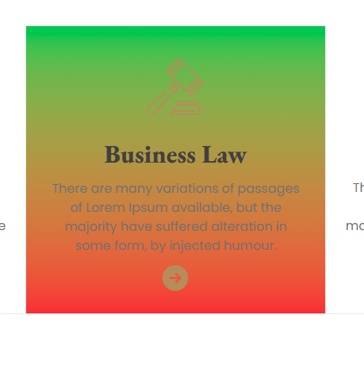
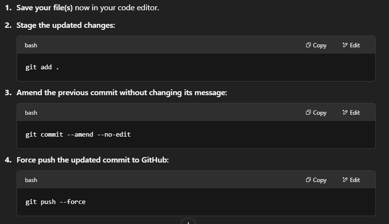
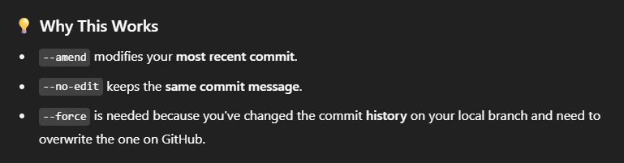
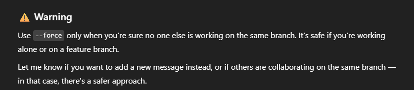

## What I Learned new While Building This Project

1. we annot create your own custom-named daisiUi classes (like `--color-dark1`, `--color-dark2`, etc.) but we can override DaisyUI’s built-in theme classes names (like `--color-primary`, `--color-secondary`, `--color-accent`, etc.) with our own values.

```css
<!-- DaisyUI Theme Customization -->
<style>
  [data-theme="light"] {
    --color-primary: #B68C5A;

    /* These custom values won't work with DaisyUI components: */
    --color-dark1: #111111;
    --color-dark2: #414040;
    --color-dark3: #707070;
    --color-dark4: #A0A0A0;
    --color-dark5: #CFCFCF;
    --color-dark6: #E7E7E7;
    --color-dark7: #F3F3F3;

    /* but These will work, because they are DaisyUI’s predefined theme class names: */
    --color-secondary: #111111;
    --color-accent: #414040;
    --color-base-100: #707070;
    --color-base-200: #A0A0A0;
    --color-base-300: #CFCFCF;
  }
</style>
```
2. I thought bg-linear-to-t from-red-500 to-green-500 means the gradient starts on the top from the red color to green color, but today I noticed that I was wrong.
- bg-gradient-to-t means the gradient goes from bottom to top.
- from-red-500: the start color is red-500, applied at the bottom.
- to-green-500: the end color is green-500, applied at the top.



3. I pushed a commit, then realized that I forgot to save some changes. So later I learned how to update the last commit (even after pushing) from ChatGPT: 

**Steps:**





